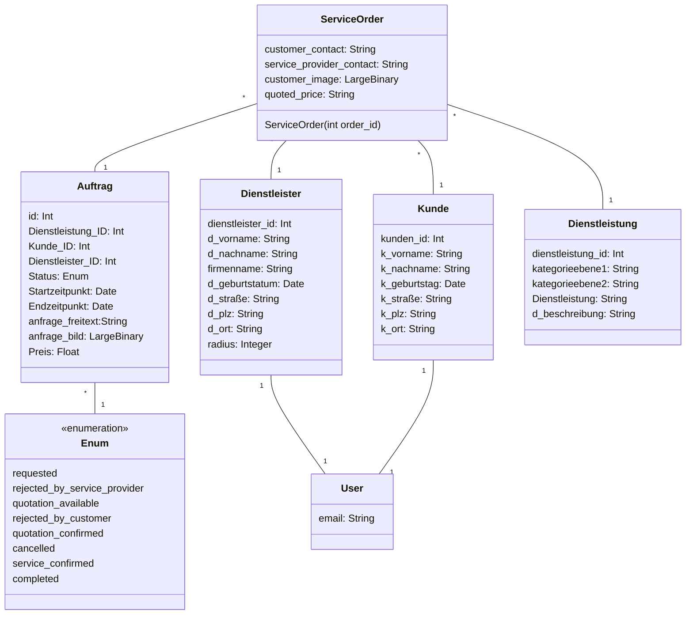

```mermaid
 classDiagram
    class ServiceOrder{
        customer_contact: String
        service_provider_contact: String
        customer_image: LargeBinary
        quoted_price: String
        ServiceOrder(int order_id)
    }
    
    ServiceOrder "*" -- "1" Auftrag
    ServiceOrder "*" -- "1" Kunde
    ServiceOrder "*" -- "1" Dienstleister
    ServiceOrder "*" -- "1" Dienstleistung

    class Auftrag {
        id: Int
        Dienstleistung_ID: Int
        Kunde_ID: Int
        Dienstleister_ID: Int
        Status: Enum
        Startzeitpunkt: Date
        Endzeitpunkt: Date
        anfrage_freitext:String
        anfrage_bild: LargeBinary
        Preis: Float
    }

    Auftrag "*" -- "1"Enum

    class Enum {
        <<enumeration>>
        requested
        rejected_by_service_provider
        quotation_available
        rejected_by_customer
        quotation_confirmed
        cancelled
        service_confirmed
        completed
    }

    class Kunde {
        kunden_id: Int
        k_vorname: String
        k_nachname: String
        k_geburtstag: Date
        k_straße: String
        k_plz: String
        k_ort: String
    }

    class Dienstleister {
        dienstleister_id: Int
        d_vorname: String
        d_nachname: String
        firmenname: String
        d_geburtstatum: Date
        d_straße: String
        d_plz: String
        d_ort: String
        radius: Integer
    }

    Dienstleister "1" -- "1" User
    Kunde "1" -- "1" User

    class User {
        email: String
    }

    class Dienstleistung {
        dienstleistung_id: Int
        kategorieebene1: String
        kategorieebene2: String
        Dienstleistung: String
        d_beschreibung: String
    }


```