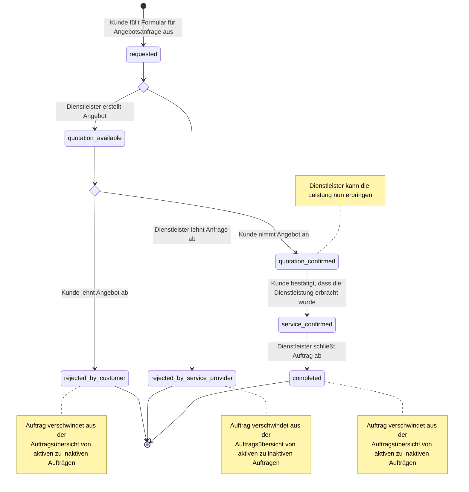

```mermaid
stateDiagram-v2
    [*] --> requested: Kunde füllt Formular für Angebotsanfrage aus

    state quotation_choice_service_provider <<choice>>
    requested --> quotation_choice_service_provider
    quotation_choice_service_provider --> rejected_by_service_provider: DIenstleister lehnt Anfrage ab

    state quotation_choice_customer <<choice>>
    quotation_choice_customer --> rejected_by_customer: Kunde lehnt Angebot ab
    quotation_choice_service_provider --> quotation_available: Dienstleister erstellt Angebot
    quotation_available --> quotation_choice_customer
    quotation_choice_customer --> quotation_confirmed: Kunde nimmt Angebot an
        note left of quotation_confirmed
        Dienstleister kann die Leistung nun erbringen
        end note

    quotation_confirmed --> service_confirmed: Kunde bestätigt, dass die Dienstleistung erbracht wurde
        note right of rejected_by_customer
        Auftrag verschwindet aus der
        Auftragsübersicht von aktiven zu inaktiven Aufträgen
        end note
        note right of rejected_by_service_provider
        Auftrag verschwindet aus der
        Auftragsübersicht von aktiven zu inaktiven Aufträgen
        end note


    service_confirmed --> completed: Dienstleister schließt Auftrag ab
        note right of completed
        Auftrag verschwindet aus der
        Auftragsübersicht von aktiven zu inaktiven Aufträgen
        end note

    rejected_by_customer --> [*]
    rejected_by_service_provider --> [*]
    completed --> [*]

```